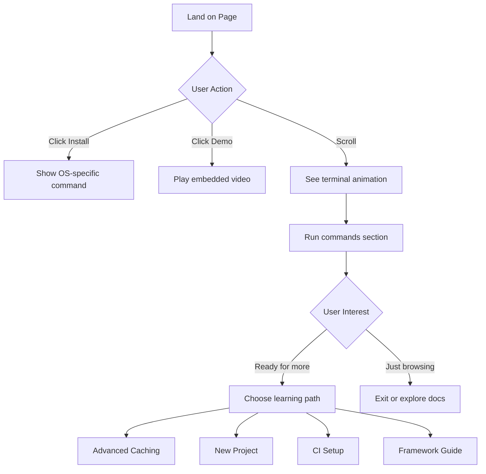

# Intro Page Wireframe

## Current vs. Proposed Layout

### Current Layout (Too Much, Too Soon)
```
┌─────────────────────────────────────────────────────────┐
│  Getting Started with Nx                                │
│  ┌─────────────────────────────────────────────────┐  │
│  │ Nx is a powerful build system with monorepo...  │  │
│  │ [Long explanation about what Nx is]             │  │
│  │ [Feature list with 10+ items]                   │  │
│  │ [Multiple ways to get started]                  │  │
│  └─────────────────────────────────────────────────┘  │
│                                                         │
│  ┌─────────┐ ┌─────────┐ ┌─────────┐ ┌─────────┐     │
│  │ React   │ │ Angular │ │  Vue    │ │  Node   │     │
│  └─────────┘ └─────────┘ └─────────┘ └─────────┘     │
│                                                         │
│  ┌─────────────────────────────────────────────────┐  │
│  │ Installation Options                            │  │
│  │ - npm install                                   │  │
│  │ - yarn add                                      │  │
│  │ - pnpm install                                  │  │
│  │ - brew install                                  │  │
│  └─────────────────────────────────────────────────┘  │
│                                                         │
│  [More sections below the fold...]                     │
└─────────────────────────────────────────────────────────┘
```

### Proposed Layout (Clear, Focused, Fast)
```
┌─────────────────────────────────────────────────────────┐
│  Make Your Builds 10x Faster                           │
│  Nx understands your code and only runs what's needed. │
│                                                         │
│  ┌──────────────┐  ┌─────────────────┐                │
│  │ Install Nx   │  │ Watch 2min Demo │                │
│  └──────────────┘  └─────────────────┘                │
├─────────────────────────────────────────────────────────┤
│  See It In Action                                      │
│  ┌─────────────────────────────────────────────────┐  │
│  │ $ npm run build      # Before: 45 seconds ⏱️    │  │
│  │ ████████████████████████████████████ 100%      │  │
│  │                                                 │  │
│  │ $ npm run build      # After: 4 seconds ⚡     │  │
│  │ ████ 100% (cached)                              │  │
│  └─────────────────────────────────────────────────┘  │
├─────────────────────────────────────────────────────────┤
│  Get Started in 3 Steps                                │
│                                                         │
│  1️⃣ brew install nx                                    │
│                                                         │
│  2️⃣ nx init                                            │
│                                                         │
│  3️⃣ nx build                                           │
│                                                         │
│  ✨ That's it! Your builds are now cached.            │
├─────────────────────────────────────────────────────────┤
│  Ready for More?                                       │
│  ┌───────────────┐ ┌───────────────┐                  │
│  │ See Advanced  │ │ Start New     │                  │
│  │ Caching       │ │ Project       │                  │
│  └───────────────┘ └───────────────┘                  │
│  ┌───────────────┐ ┌───────────────┐                  │
│  │ Setup CI      │ │ Framework     │                  │
│  │ Optimization  │ │ Guides        │                  │
│  └───────────────┘ └───────────────┘                  │
└─────────────────────────────────────────────────────────┘
```

## Mobile View (Simplified Further)
```
┌─────────────────────┐
│ Make Your Builds    │
│ 10x Faster         │
│                    │
│ ┌─────────────────┐│
│ │  Install Nx     ││
│ └─────────────────┘│
│                    │
│ ┌─────────────────┐│
│ │ Watch Demo      ││
│ └─────────────────┘│
├────────────────────┤
│ Before: 45s ⏱️     │
│ ████████████ 100%  │
│                    │
│ After: 4s ⚡       │
│ ██ 100% (cached)   │
├────────────────────┤
│ 1. brew install nx │
│ 2. nx init        │
│ 3. nx build       │
│                    │
│ ✨ You're done!    │
└────────────────────┘
```

## Key Design Principles

1. **Above the Fold**: Value proposition + immediate action
2. **Show, Don't Tell**: Live demo instead of explanation
3. **Linear Path**: One clear next step at each point
4. **Progressive Disclosure**: Advanced options only after basics
5. **Mobile First**: Works perfectly on small screens

## Interactive Elements Plan



## Color Scheme & Visual Design

- **Primary**: Nx brand blue (#0EA5E9)
- **Success**: Green for speed improvements (#10B981)
- **Background**: Clean white/light gray
- **Code blocks**: Dark theme for contrast
- **Animations**: Subtle, performance-focused

## Measurement Points

1. **Engagement**: Track how far users scroll
2. **Actions**: Which CTA gets more clicks
3. **Time to Action**: How long before running first command
4. **Drop-off Points**: Where users leave the page