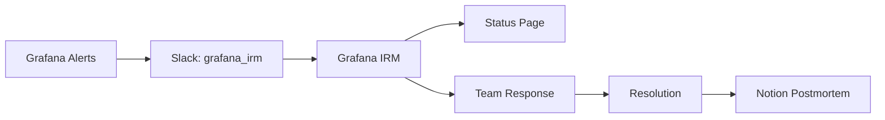

# Incident Response Overview

> 🚨 **All incidents are managed through Grafana IRM**

## Quick Start

**Something wrong?** → Check `grafana_irm` Slack channel → Create incident in Grafana IRM

## Our Incident Response Stack



## Tools & Their Purpose

### 🔔 Grafana
- **What**: Monitoring and alerting
- **Alerts On**: 503s, errors, downtime, API issues
- **Action**: Sends alerts to Slack

### 💬 Slack Channel: `grafana_irm`
- **What**: Alert notifications and team communication
- **Who**: All engineers, especially on-call
- **Action**: Monitor, acknowledge, coordinate

### 🚨 Grafana IRM
- **What**: Incident management system
- **Features**: 
  - Create and track incidents
  - Manage on-call schedules
  - Integrate with status page
  - Generate metrics
- **Action**: All incidents created here

### 📊 Status Page (status.nx.dev)
- **What**: Customer-facing service status
- **Updates**: Automatically from Grafana IRM
- **Audience**: Public cloud, single tenant, enterprise customers

### 📝 Notion
- **What**: Postmortem documentation ONLY
- **When**: After incident resolution
- **Content**: Root cause, timeline, action items
- **Not Used For**: Incident tracking or reports

## Process Flow

### 1. Detection
```
Grafana detects issue → Alert fires → Appears in grafana_irm channel
```

### 2. Response
```
On-call acknowledges → Creates incident in Grafana IRM → Status page updates
```

### 3. Resolution
```
Team investigates → Applies fix → Monitors → Closes incident
```

### 4. Learning
```
Postmortem in Notion → Action items tracked → Process improvements
```

## On-Call Rotation

- **Schedule**: Weekly (Monday to Monday)
- **Teams**: Infrastructure + Application
- **Frequency**: ~2 months between rotations
- **Coverage**: Working hours primary

## Communication Guidelines

### Internal
- **Primary**: `grafana_irm` Slack channel
- **War Room**: Zoom or Slack Huddle
- **Updates**: Every 30 minutes during incidents

### External
- **Automated**: Status page via Grafana IRM
- **Manual**: DPE team for specific customers
- **Support**: Maria (Account Manager) assists

## First Response Playbook

### For Most Issues:
```bash
# 1. Restart the service
kubectl rollout restart deployment/[name]

# 2. Monitor
kubectl get pods -w

# 3. Check logs
kubectl logs -f [pod-name]
```

### If That Doesn't Work:
1. Check Grafana dashboards
2. Review recent deployments
3. Investigate application logs
4. Escalate to code changes

## Key Principles

1. **Single Source of Truth**: Grafana IRM for all incidents
2. **Clear Separation**: Incidents in Grafana, postmortems in Notion
3. **Automated Updates**: Status page syncs with Grafana IRM
4. **Rapid Response**: Pod restarts solve most issues
5. **Learn & Improve**: Every significant incident gets a postmortem

## Important URLs

- **Status Page**: https://status.nx.dev
- **Slack Channel**: #grafana_irm
- **Grafana IRM**: [internal link]
- **Postmortem DB**: [Notion link]

## Need Help?

- **On-Call**: Check Grafana IRM schedule
- **Escalation**: On-call → Team Lead → Manager → CTO
- **Questions**: Ask in #grafana_irm

---

*Last Updated: 2025-06-13*  
*Process Owner: Infrastructure Team*