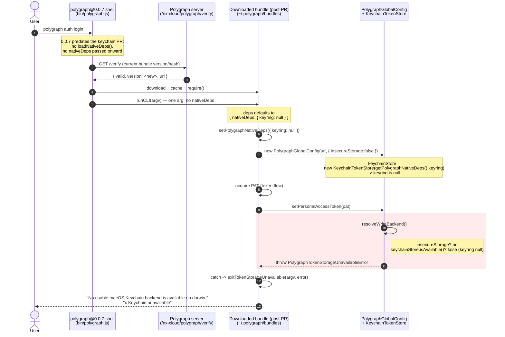

# Polygraph keychain unavailable: stale shell (0.0.7) + updated bundle

Trace of the exact code path that produced:

```
No usable macOS Keychain backend is available on darwin.
✖ Keychain unavailable
```

## Root cause (one line)

The npm shell (`polygraph@0.0.7`) predated the keychain PR, so it never loaded
`@napi-rs/keyring` and never passed `nativeDeps` into the bundle. The
auto-updated bundle (post-PR) received `keyring: null`, so `KeychainTokenStore`
reported unavailable and the write backend threw.

## Key architectural fact

Native deps are loaded by the **shell** (npm-installed, lazy upgrade) and handed
to the **bundle** (server-pushed, auto-updates) via `runCLI(argv, { nativeDeps })`.
The shell and bundle are separate esbuild outputs with separate copies of
`polygraph-cli-shared`, so the bundle's module-level `currentNativeDeps` is
whatever the bundle's own `runCLI` set it to - NOT what the shell set.

- Shell 0.0.7 calls `bundle.runCLI(argv)` with ONE arg (no `nativeDeps`).
- Bundle `runCLI(args, deps = { nativeDeps: { keyring: null } })` -> default kicks in.
- `setPolygraphNativeDeps({ keyring: null })` (bundle's copy).
- Every `KeychainTokenStore` built later gets `keyring: null`.

## Decision point that threw

`PolygraphGlobalConfig.setPersonalAccessToken` -> `resolveWriteBackend()`:

```
insecureStorage? .................. no (no --insecure-storage flag)
keychainStore.isAvailable()? ...... false (keyring is null)
-> throw PolygraphTokenStorageUnavailableError()
```

Note: reads do NOT throw (`getPersonalAccessToken` checks `isAvailable()` first
and falls through to the INI store). Only the WRITE path throws, which is why
the error surfaced at `auth login` token-store time, not at startup.

---

## ASCII sequence diagram

```
User        polygraph@0.0.7 shell      Polygraph server      bundle (post-PR)      PolygraphGlobalConfig / TokenStore
 |          (bin/polygraph.js)          (/verify)            (~/.polygraph/...)
 |                |                          |                     |                          |
 | polygraph auth login                      |                     |                          |
 |--------------->|                          |                     |                          |
 |                |                          |                     |                          |
 |                | (0.0.7 predates PR:                            |                          |
 |                |  NO loadNativeDeps(),                          |                          |
 |                |  NO setPolygraphNativeDeps)                    |                          |
 |                |                          |                     |                          |
 |                | verifyOrUpdateBundle GET /nx-cloud/polygraph/verify                       |
 |                |------------------------->|                     |                          |
 |                |   { valid, version: <new>, url }               |                          |
 |                |<-------------------------|                     |                          |
 |                | download + cache + require() new bundle        |                          |
 |                |---------------------------------------------->|                          |
 |                |                          |                     |                          |
 |                | bundle.runCLI(argv)   <-- ONE arg, no nativeDeps                          |
 |                |---------------------------------------------->|                          |
 |                |                          |                     | deps defaults to         |
 |                |                          |                     | { nativeDeps:{keyring:null} }
 |                |                          |                     | setPolygraphNativeDeps({keyring:null})
 |                |                          |                     |                          |
 |                |                          |                     | login(argv)              |
 |                |                          |                     | new PolygraphGlobalConfig(url,{insecureStorage:false})
 |                |                          |                     |------------------------->|
 |                |                          |                     |   keychainStore =        |
 |                |                          |                     |   new KeychainTokenStore(
 |                |                          |                     |     getPolygraphNativeDeps().keyring  // null
 |                |                          |                     |   )                      |
 |                |                          |                     |                          |
 |                |                          |                     | (acquire PAT via flow)   |
 |                |                          |                     | config.setPersonalAccessToken(pat)
 |                |                          |                     |------------------------->|
 |                |                          |                     |   resolveWriteBackend(): |
 |                |                          |                     |    insecureStorage? no   |
 |                |                          |                     |    keychainStore.isAvailable()?
 |                |                          |                     |      keyring==null -> false
 |                |                          |                     |    throw PolygraphTokenStorageUnavailableError
 |                |                          |                     |<-------------------------|
 |                |                          |                     | catch -> exitTokenStorageUnavailable
 |                |                          |                     |                          |
 |  "No usable macOS Keychain backend is available on darwin."     |                          |
 |  "x Keychain unavailable"                |                     |                          |
 |<---------------------------------------------------------------|                          |
 |                |                          |                     |                          |
```

---

## Mermaid sequence diagram



---

## Why upgrading to 0.1.0 fixed it

0.1.0 shell ships `@napi-rs/keyring` (+ `darwin-arm64` optional binary) and the
new bootstrap:

```
loadNativeDeps() -> require('@napi-rs/keyring')   // resolves now
setPolygraphNativeDeps(nativeDeps)
bundle.runCLI(argv, { nativeDeps })               // TWO args
```

Bundle now gets a real keyring -> `isAvailable()` true -> write backend =
keychain -> PAT stored in macOS Keychain.

## The latent risk this exposes

`runCLI`'s default + read-path tolerance keep old-shell + new-bundle from
crashing, but the WRITE path hard-throws and the message blames Keychain
instead of "your CLI shell is stale". Since the bundle auto-updates and the
shell upgrades lazily, new-bundle/old-shell is the common skew. Follow-up:
bundle should feature-detect the shell-provided keyring and either fall back to
INI with an "upgrade for secure storage" notice, or gate on
`process.env.POLYGRAPH_CLI_VERSION` and print "needs polygraph >= X".
